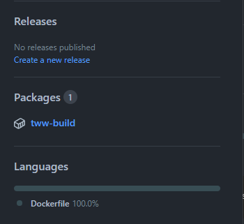
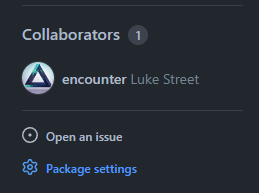
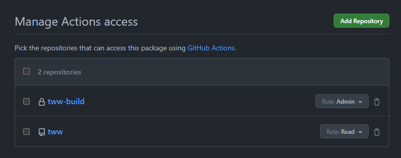

# GitHub Actions

This repository includes [.github.example/workflows/build.yml](/.github.example/workflows/build.yml) as an example CI workflow. To use it for your project, follow the setup instructions below.

- [Build Repository](#build-repository)
- [Workflow](#workflow)
- [decomp.dev](#decompdev)

## Build Repository

This repository will be used to build and store the CI build container.

> [!CAUTION]
> This repository should be **private** to avoid exposing the game's assets.

1. [Create a **private** repository from `encounter/dtk-template-build`](https://github.com/new?template_name=dtk-template-build&template_owner=encounter). A common name is your project's repository name with `-build` appended. For example, `tww-build`.

2. Once the repository is created, add your game's assets to the `orig/GAMEID` directory. (Replace `GAMEID` with your game's ID, matching the `orig` layout in your main repository.)  
    **Only include game files necessary for the build**, such as `sys/main.dol` and any `.rel` or `.sel` files.

3. Once the build container action completes, visit the package settings:  
      
    

4. Under "Manage Actions access", add your project's main repository with the "Read" role:  
    

## Workflow

1. Rename `.github.example` to `.github`.

2. In `build.yml`, update the `container:` to point to the new [build image](#build-repository).

3. In `build.yml`, replace `GAMEID` with your game's ID. (Or list of IDs, for multi-version support.)

4. Commit and push the changes to your repository.

If everything is set up correctly, the workflow will build all versions on every push or pull request.

## decomp.dev

Once the build workflow is running on the main branch, you can add your game to <https://decomp.dev>.

Visit <https://decomp.dev/manage/new>, select your GitHub repository and fill out the required fields.

If you have questions or issues, try asking in the [GC/Wii Decompilation Discord](https://discord.gg/hKx3FJJgrV) #decomp.dev channel.

## Progress page (GitHub Pages)

Every push to `main` also publishes the progress dashboard (`tools/dashboard/server.py`, the same
page as the local one minus the "in flight" panel) to GitHub Pages:

1. `tools/dashboard/pages.py append` adds the run's numbers (sha, date, exact functions, matched and
   linked code and data, all from `report.json`) to `history.json` on the data-only branch
   `pages-history` (created by the first run if it does not exist).
2. `server.py --export site --history ...` writes `index.html`, `progress.json` and `history.json`.
3. The `pages` job deploys `site/` with `actions/deploy-pages`.

Only `report.json`-derived numbers, file (unit) names and commit subjects are published: no game
data, nothing from `/orig`.

One-time setup: Settings > Pages > Build and deployment > Source: **GitHub Actions**. To give the
chart real matched numbers for past commits, seed the history once on a machine with `orig/`:

    python tools/dashboard/backfill_history.py 2bf605c --pages-history history.json

then commit that `history.json` as the only file of the `pages-history` branch (it builds main's
149 first-parent commits, about 30 s each). Without the seed, the chart starts at the first CI run.
